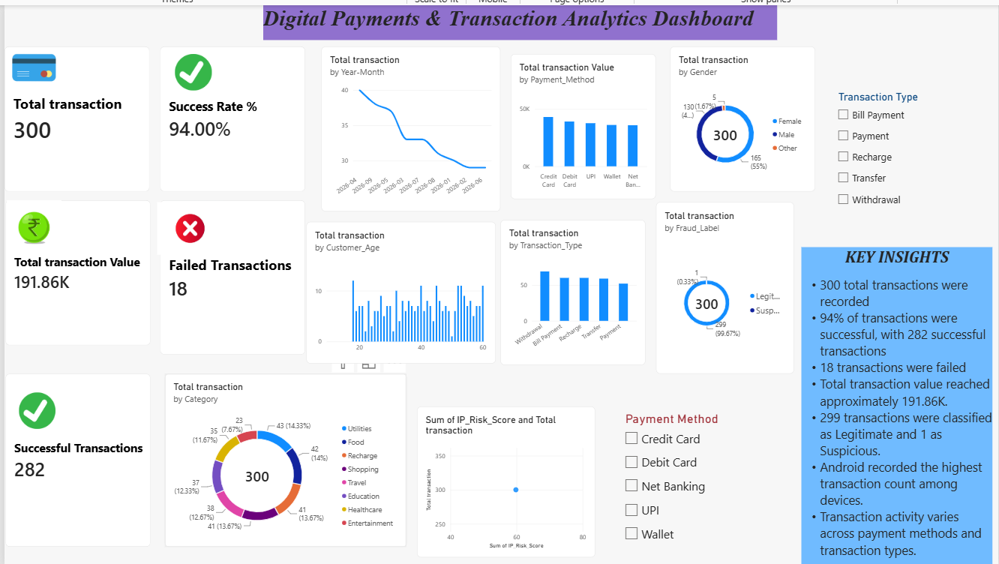

# Digital Payments & Transaction Analytics
An interactive Power BI dashboard for analyzing digital payment transactions, transaction values, success rates, payment methods, transaction types, customer demographics, and fraud status.

## Dashboard Preview

## Key Insights
- 300 total transactions were analyzed.
- Overall transaction success rate was 94%.
- 282 transactions were successful and 18 were failed.
- Total transaction value was approximately 191.86K.
- 299 transactions were classified as legitimate and 1 as suspicious.
- Transaction activity was analyzed across payment methods, transaction types, categories, gender, age, and devices.

## Tools & Technologies
- Power BI
- Microsoft Excel
- Data Visualization
- Data Analysis

## Files
- `Digital_Payments_Dashboard.pbix` — Power BI dashboard
- `Digital_Payments_Dataset.xlsx` — Dataset used for analysis
- `dashboard_preview.png` — Dashboard preview

## How to Use
1. Download the `.pbix` file.
2. Open it using Microsoft Power BI Desktop.
3. Use the available filters and slicers to explore the dashboard.
